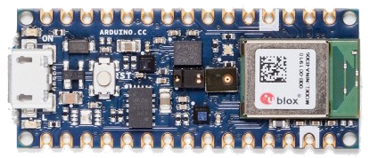

.. _arduino_nano_33_ble:

Arduino Nano 33 BLE (Sense)
#################################

Overview
********

The Arduino Nano 33 BLE is designed around Nordic Semiconductor's
nRF52840 ARM Cortex-M4F CPU. Arduino sells 2 variants of the board, the
plain `BLE`_ type and the `BLE Sense`_ type. The "Sense" variant is distinguished by
the inclusion of more sensors, but otherwise both variants are the same.

The Sense variant of the board

Hardware
********

Supported Features
==================

The package is configured to support the following hardware:

+-----------+------------+----------------------+
| Interface | Controller | Driver/Component     |
+===========+============+======================+
| ADC       | on-chip    | adc                  |
+-----------+------------+----------------------+
| CLOCK     | on-chip    | clock_control        |
+-----------+------------+----------------------+
| FLASH     | on-chip    | flash                |
+-----------+------------+----------------------+
| GPIO      | on-chip    | gpio                 |
+-----------+------------+----------------------+
| I2C0      | on-chip    | i2c                  |
+-----------+------------+----------------------+
| I2C1      | on-chip    | i2c                  |
+-----------+------------+----------------------+
| MPU       | on-chip    | arch/arm             |
+-----------+------------+----------------------+
| NVIC      | on-chip    | arch/arm             |
+-----------+------------+----------------------+
| PWM       | on-chip    | pwm                  |
+-----------+------------+----------------------+
| RADIO     | on-chip    | Bluetooth,           |
|           |            | ieee802154           |
+-----------+------------+----------------------+
| RTC       | on-chip    | system clock         |
+-----------+------------+----------------------+
| SPI       | on-chip    | spi                  |
+-----------+------------+----------------------+
| UART      | on-chip    | serial               |
+-----------+------------+----------------------+
| USB       | on-chip    | usb                  |
+-----------+------------+----------------------+
| WDT       | on-chip    | watchdog             |
+-----------+------------+----------------------+

Other hardware features are not supported by the Zephyr kernel.

Notably, this includes the PDM (microphone) interface.

Connections and IOs
===================

The `schematic`_ will tell you everything
you need to know about the pins.

A convinience header mapping the Arduino pin names to their
Zephyr pin numbers can be found in "arduino_nano_33_ble_pins.h"

Programming and Debugging
*************************

The package is designed to reuse Arduino's custom version of BOSSAC.
WINDOWS USERS: will need to get a copy of this special fork. You can
do this by:

#. Downloading the Arduino IDE
#. Installing the Arduino Nano BLE 33 support package from within Arduino
#. Changing your preferences to make uploading make verbose logs
#. Uploading an image, and copying the bossac executable used into your PATH

ALL PLATFORMS: will need to use this batch/bash script instead of "west flash":

.. code-block:: bash

   bossac -d --port="<put the com port or TTY device>" -U -i -e -w build/zephyr/zephyr.bin -R

Flashing
========

Attach the board to your computer using the USB cable, and then

   .. zephyr-app-commands::
      :zephyr-app: samples/blinky
      :board: arduino_nano_33_ble
      :goals: build
      :compact:

Double-tap the RESET button on your board. Your board should disconnect, reconnect,
and there should be a pulsing orange LED near the USB port.

Then, you can flash the image using the above script.

You should see the the red LED blink.

References
**********

.. target-notes::

.. _BLE:
    https://store.arduino.cc/usa/nano-33-ble/

.. _BLE SENSE:
    https://store.arduino.cc/usa/nano-33-ble-sense/

.. _pinouts:
    https://learn.adafruit.com/introducing-the-adafruit-nrf52840-feather/pinouts

.. _schematic:
    https://content.arduino.cc/assets/NANO33BLE_V2.0_sch.pdf
